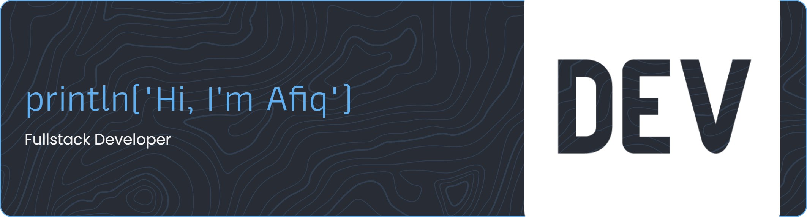

# Hey There! 👋

I love turning ideas into experiences — from designing engaging UI/UX systems to building them into real products on web and mobile platforms.

## ⚙️ Tech Stack

## 📈 My GitHub Stats

  <a href="https://github.com/afiqalghazali">
    <picture>
      
    </picture>
  </a>
  <a href="https://github.com/afiqalghazali">
    <picture>
      
    </picture>
  </a>

## 🤝 Connect with me

 
